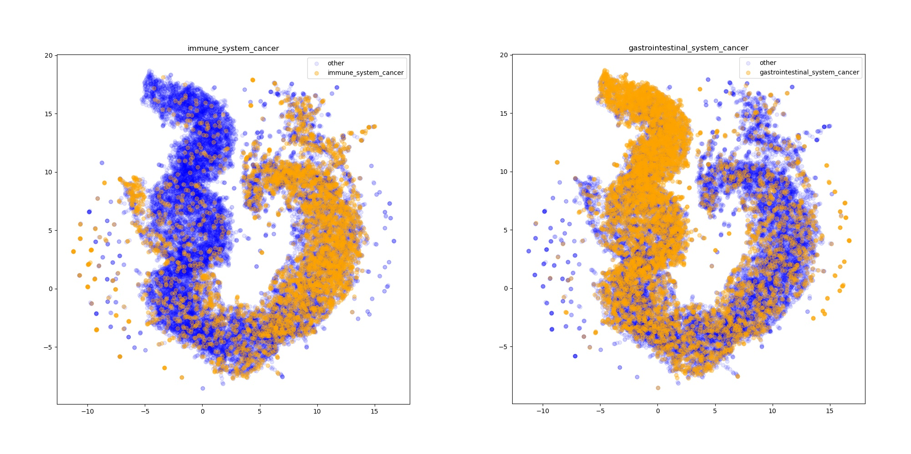

# Deep Representations of Somatic Mutations in Cancer Samples

This repository describes in detail a methodology for the embedding of somatic mutations profiles in human cancer. Its aim specifically is to offer this tool to any researcher that might want to include such a procedure in their work.
The following sections describe the approach used to learn representations of cancer samples, the experimental design, and the steps necessary to use or reproduce the results.

## Dataset

The following model is trained using the [Sanger Catalogue of Somatic Mutations in Cancer (COSMIC)](https://cancer.sanger.ac.uk/cosmic) database, which is a curated source of information on somatic mutations in human cancer. We are specifically interested in its vast amount of genome-wide screen data, which is a rich resource for the training of deep learning model.

More specifically, we make use of the "COSMIC Mutation Data (Genome Screens)" dataset that is available in version v92 of the project, which offers information on individual somatic mutations present in cancer samples. To reproduce the results shown in this repository, it is necessary to download and extract this dataset in the root folder of the project.

With the mutation data, we aim to encode each cancer sample as a binary vector where each component signals whether a mutation in the corresponding gene is observed. More accurately, a cancer sample is represented by two such vectors, as we follow the design choices of Palazzo et al. (2019), with which we consider deleterious and non-deleterious mutations separately.

The somatic mutations in the dataset are filtered according to the following quality control criteria:
- labelled as "Confirmed somatic variant"
- they must come from a genome-wide screen study
- mapped onto the GRCh38 reference genome
- the mutations must correspond to a gene (only coding mutations), i.e. there is an HGNC identifier available
- we exclude hypermutated samples (>1000 mutation) according to previous works in the literature (Vogelstein et al. (2013))
- underrepresented genes are removed (gene mutations that appear fewer than 100 times)

The resulting processed dataset includes 5.491.567 somatic mutations in 12.449 unique genes from 26.355 cancer samples.

## Model

The model chosen for the embedding of somatic mutation profiles is a bimodal Beta Variational Autoencoder (VAE). The model, inspired by the work of Palazzo et al. (2019), considers separately deleterious and non-deleterious mutations in the input stage. Contrary to the original work, we split the mutations into these two categories based on the FATHMM prediction (Shabib et al. (2015)) included in the COSMIC dataset.

We used a Beta Variational Autoencoder with warmup (Sønderby et al. (2016)), as this configuration allows the model to focus on the reconstruction of the data for the first few epochs while gradually introducting the variational objective.

## Phenotype Prediction Evaluation

To evaluate how well the learned embeddings describe the phenotype of the cancer samples, we adopted a similar approach to the work of Amar et al. (2017).

Using information from [Disease Ontology](https://disease-ontology.org/), we constructed a hierarchy of cancer subtypes, based on their site of origin and histology, which results in 56 categories. These categories were chosen so that there would be a significant enough number of samples both in the positive and negative class for each of them. If the overlap between a parent and child category was too large, we considered only the parent class.

Each cancer sample is assigned a positivae (1) or negative (0) class for each category, while respecting the hierarchical structure. Some of the categories considered (e.g. adenocarcinoma) consist of purely histological subtypes, while most other categories are related to the primary site of origin of the cancer sample. Of the 26.355 samples, 25.645 were assigned at least one category, while the remaining samples were excluded from this analysis. 

We first used a UMAP projection to visualize and observe the patterns shown by the embeddings according to their categories. The plots, available in the folder "embeddings/plots", show an interesting distribution of the various cancer subtypes in the embedding manifold. Interestingly, it appears that there is a concentration of "liquid tumours" in the right-hand side of the UMAP representation, while gastrointestinal and thoracic cancers are grouped mostly in the left branch.

To evaluate how well the embeddings capture the phenotypic information of the samples, we trained a Support Vector Machine (SVM) classified for each of the 56 categories to evaluate the prediction accuracy on a validation set. Given the imbalance of categories when using the full dataset, for each cancer subtype, where possible, a set of negative samples equal in size to the positive samples was randomly selected. This smaller subtype-specific dataset was split into training and test sets, and used for the classifier evaluations, by applying a 5-fold cross-validation scheme. The results reported in the following table represent the median value of the metrics across folds. As evidenced by the results, most cancer subtypes achieve a good accuracy score, while other subtypes (such as lung adenocarcinoma) display poor performance. This fact might indicate that for some forms of cancer, their mutational profile is strongly related to the primary site of carcinogenesis, therefor the profile itself is a strong predictor of the phenotype, while for other forms of cancer this link is weaker.

| Cancer Subtype | N. Pos. Samples | Accuracy | Precision | Recall |
| --- | --- | --- | --- | --- |
| hepatocellular_carcinoma | 849 | 65.78 % | 67.70 % | 65.73 % |
| liver_cancer | 1315 | 61.22 % | 61.60 % | 61.22 % |
| colon_adenocarcinoma | 575 | 68.70 % | 68.98 % | 68.70 % |
| colon_carcinoma | 582 | 72.53 % | 72.56 % | 72.54 % |
| colon_cancer | 633 | 68.77 % | 68.97 % | 68.77 % |
| colorectal_cancer | 633 | 71.15 % | 71.26 % | 71.16 % |
| intestinal_cancer | 1814 | 72.18 % | 72.61 % | 72.18 % |
| esophageal_carcinoma | 969 | 72.16 % | 74.49 % | 72.16 % |
| stomach_cancer | 906 | 70.52 % | 70.80 % | 70.54 % |
| biliary_tract_cancer | 613 | 53.88 % | 54.17 % | 53.82 % |
| gastrointestinal_system_cancer | 6255 | 67.59 % | 67.71 % | 67.59 % |
| integumentary_system_cancer | 668 | 53.93 % | 55.14 % | 53.90 % |
| diffuse_large_B_cell_lymphoma | 256 | 60.78 % | 61.42 % | 60.78 % |
| lymphoma | 760 | 64.80 % | 65.36 % | 64.80 % |
| acute_myeloid_leukaemia | 942 | 72.07 % | 72.78 % | 72.07 % |
| T_cell_acute_lymphoblastic_leukemia | 359 | 74.31 % | 78.45 % | 74.31 % |
| B_cell_acute_lymphoblastic_leukemia | 251 | 58.00 % | 62.86 % | 58.00 % |
| lymphoid_leukemia | 778 | 64.63 % | 66.34 % | 64.57 % |
| chronic_lymphocytic_leukemia | 798 | 73.04 % | 78.22 % | 73.10 % |
| leukemia | 3059 | 72.96 % | 76.02 % | 72.96 % |
| immune_system_cancer | 3847 | 70.76 % | 72.17 % | 70.77 % |
| breast_ductal_carcinoma | 122 | 61.22 % | 62.04 % | 60.92 % |
| breast_cancer | 1819 | 63.27 % | 65.61 % | 63.25 % |
| lung_adenocarcinoma | 778 | 49.84 % | 48.54 % | 50.00 % |
| lung_squamous_cell_carcinoma | 506 | 72.77 % | 72.95 % | 72.77 % |
| lung_cancer | 1639 | 57.56 % | 59.46 % | 57.59 % |
| respiratory_system_cancer | 2157 | 60.60 % | 61.72 % | 60.62 % |
| thoracic_cancer | 3976 | 57.57 % | 57.61 % | 57.57 % |
| ovarian_cancer | 643 | 60.31 % | 62.03 % | 60.38 % |
| cervical_cancer | 253 | 71.29 % | 71.69 % | 71.22 % |
| endometrial_cancer | 399 | 68.12 % | 71.84 % | 68.12 % |
| female_reproductive_organ_cancer | 1297 | 63.20 % | 65.60 % | 63.16 % |
| prostate_adenocarcinoma | 817 | 60.55 % | 63.60 % | 60.62 % |
| male_reproductive_organ_cancer | 1135 | 62.11 % | 62.28 % | 62.11 % |
| reproductive_organ_cancer | 2432 | 62.24 % | 65.02 % | 62.24 % |
| pancreatic_ductal_carcinoma | 737 | 57.29 % | 63.70 % | 57.20 % |
| pancreatic_cancer | 1052 | 55.58 % | 65.58 % | 55.49 % |
| thyroid_gland_cancer | 943 | 67.90 % | 72.20 % | 67.85 % |
| adrenal_gland_cancer | 318 | 71.65 % | 74.60 % | 71.52 % |
| endocrine_gland_cancer | 2403 | 60.56 % | 62.68 % | 60.54 % |
| clear_cell_renal_cell_carcinoma | 1161 | 61.08 % | 64.83 % | 61.13 % |
| kidney_cancer | 1938 | 61.81 % | 63.40 % | 61.78 % |
| urinary_bladder_cancer | 501 | 66.00 % | 66.54 % | 66.00 % |
| urinary_system_cancer | 2439 | 55.53 % | 56.31 % | 55.53 % |
| brain_glioma | 1451 | 65.40 % | 69.50 % | 65.44 % |
| brain_cancer | 1820 | 57.14 % | 63.72 % | 57.14 % |
| central_nervous_system_cancer | 2171 | 57.54 % | 63.00 % | 57.57 % |
| nervous_system_cancer | 2703 | 61.24 % | 62.65 % | 61.22 % |
| connective_tissue_cancer | 505 | 65.84 % | 69.77 % | 65.84 % |
| squamous_cell_carcinoma | 2273 | 70.44 % | 70.92 % | 70.44 % |
| adenocarcinoma | 4079 | 62.56 % | 62.96 % | 62.56 % |
| carcinoma | 16377 | 71.46 % | 68.96 % | 67.04 % |
| astrocytoma | 972 | 61.44 % | 64.25 % | 61.50 % |
| malignant_glioma | 1656 | 64.40 % | 68.44 % | 64.36 % |
| cancer | 25233 | 98.40 % | 49.20 % | 50.00 % |
| benign_neoplasm | 416 | 56.63 % | 56.88 % | 56.63 % |

## Reproducing the Results

To reproduce the results of this project, download and extract the "COSMIC Mutation Data (Genome Screens)" dataset (version v92) in the root folder of the project, and then execute the following files in order:
1. _COSMIC Data Processing.ipynb_ notebook
2. _train_model.py_
3. _embed_cancer_samples.py_
4. _evaluate_embeddings.py_

The files require a python 3 setup with the packages listed in _requirements.txt_

## Files Description
- _COSMIC Data Processing.ipynb_: this jupyter  notebook contains all the proedures to process the raw Mutation Data dataset into the formats required by the VAE model

## References
- Amar, D., Izraeli, S., & Shamir, R. (2017). _Utilizing somatic mutation data from numerous studies for cancer research: proof of concept and applications._ Oncogene, 36(24), 3375-3383
- Palazzo, M., Beauseroy, P., & Yankilevich, P. (2019). _A pan-cancer somatic mutation embedding using autoencoders._ BMC bioinformatics, 20(1), 655
- Shihab, H. A., Rogers, M. F., Gough, J., Mort, M., Cooper, D. N., Day, I. N., ... & Campbell, C. (2015). _An integrative approach to predicting the functional effects of non-coding and coding sequence variation._ Bioinformatics, 31(10), 1536-1543.
- Sønderby, C. K., Raiko, T., Maaløe, L., Sønderby, S. K., & Winther, O. (2016). _Ladder variational autoencoders._ In Advances in neural information processing systems (pp. 3738-3746).
- Vogelstein, B., Papadopoulos, N., Velculescu, V. E., Zhou, S., Diaz, L. A., and Kinzler, K. W. (2013). _Cancer genome landscapes_
